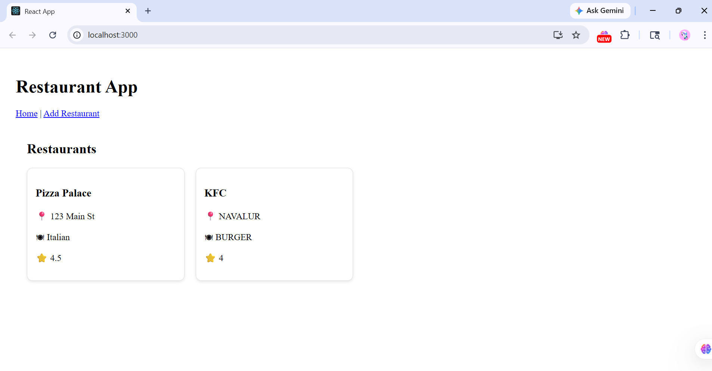
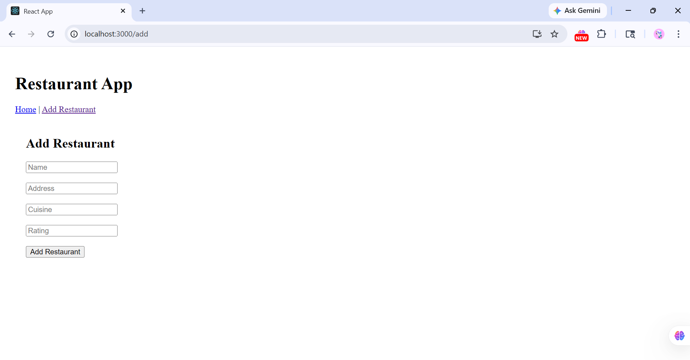

# 🍽 Restaurant App - Frontend

## 🚀 Tech Stack

* React.js
* Axios (API calls)
* React Router DOM (Navigation)

---

## 📂 Project Structure

```
frontend/
 ├── src/
 │    ├── pages/
 │    │     ├── Home.js
 │    │     ├── AddRestaurant.js
 │    ├── services/
 │    │     └── api.js
 │    ├── App.js
 │    └── index.js
 ├── package.json
```

---

## ⚙️ Features

* 📋 View all restaurants
* ➕ Add new restaurant
* 🌐 Connects with Spring Boot backend API
* 📦 Uses Axios for API calls
* 🔀 Routing with React Router

---

## ▶️ How to Run

### 1️⃣ Install dependencies

```
npm install
```

### 2️⃣ Start the app

```
npm start
```

👉 App will run at:

```
http://localhost:3000
```

---

## 🌐 API Configuration

Make sure backend is running at:

```
http://localhost:8080
```

Update API file:

📄 `src/services/api.js`

```
const BASE_URL = "http://localhost:8080/api/restaurants";
```

---

## 🔗 Pages

| Route  | Description          |
| ------ | -------------------- |
| `/`    | View all restaurants |
| `/add` | Add new restaurant   |

---

## 📌 Notes

* Backend must be running before frontend
* CORS should be enabled in Spring Boot
* Ensure MongoDB is connected

---

✨ Built as part of a full-stack learning project


